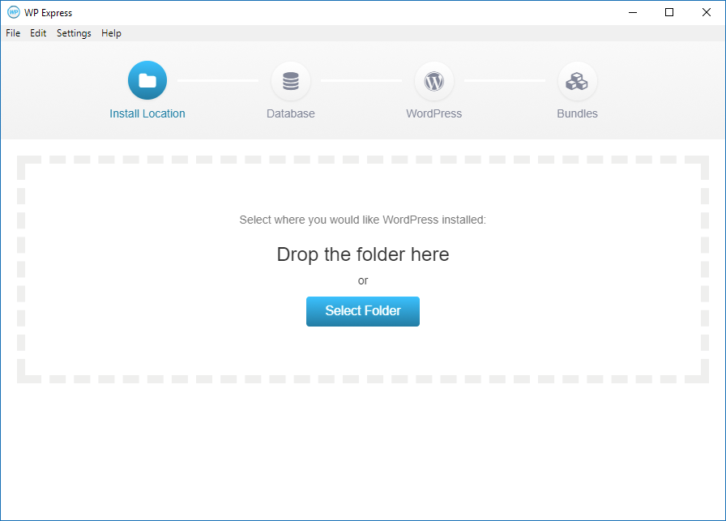

# WP Express

WordPress installer app built on Electron.



## Installation

In the main directory run:

```
npm install
```

Then again in the `app` directory run:

```
npm install
```

### Windows

[Download PHP binaries](https://windows.php.net/download) (version 5.3.29 or later) and extract them into the `app/bin/win32/php` directory so the path to `php.exe` looks like `app/bin/win32/php/php.exe`

### OSX / Linux

[Download PHP binaries](http://php.net/downloads.php) (version 5.3.29 or later) and extract them into the `app/bin/osx` directory so the path to `php` looks like `app/bin/osx/php`

## Running the Application

From the main directory run 

```
npm run start
```

## Usage

Step by step instructions can be viewed at [http://wpexpress.io/](http://wpexpress.io/)